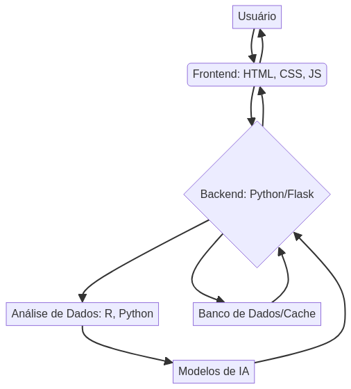

# AI Content Generator

[Português](README.md) | [English](README_en.md)


Advanced AI content generation platform that combines multiple technologies to create automated texts, analyses, and reports with a modern and responsive web interface.

## 🎯 Overview

Complete content generation system that uses artificial intelligence to create texts, perform statistical analyses, and generate interactive reports with a professional web interface.

### ✨ Key Features

- **🤖 Content Generation**: AI for automatic text and article creation
- **📊 Statistical Analysis**: Data processing with R and Python
- **🌐 Web Interface**: Modern and responsive frontend
- **📈 Visualizations**: Interactive graphs and real-time dashboards
- **🔄 Multi-language**: Python, JavaScript, R, and HTML/CSS integration
- **⚡ Performance**: Optimized processing and intelligent caching

## 🛠️ Technology Stack

### Frontend
- **HTML5**: Modern semantic structure
- **CSS3**: Grid, Flexbox, responsive animations
- **JavaScript (ES6+)**: Interactive functionalities and modern APIs

### Backend
- **Python**: Main processing and APIs
- **Flask**: Lightweight and efficient web framework
- **R**: Statistical analysis and data visualization

### Data Analysis
- **pandas/numpy**: Data manipulation and processing
- **ggplot2/dplyr**: Visualization and analysis in R
- **scikit-learn**: Machine learning and predictive analysis

## 📁 Project Structure

```
AI-Content-Generator/
├── src/                    # Application source code
│   ├── app.py              # Main Python/Flask application
│   ├── analytics.R         # Statistical analysis scripts
│   └── content_generator.py # Content generation module
├── index.html              # Main web interface (for GitHub Pages)
├── app.js                  # JavaScript functionalities (for GitHub Pages)
├── styles.css              # Modern and responsive styles (for GitHub Pages)

├── tests/                  # Unit and integration tests
│   ├── app.test.js         # JavaScript tests
│   ├── test_analytics.R    # R tests
│   └── test_config.py      # Python tests
├── config/                 # Configuration files
│   └── config.py           # Application configurations
├── assets/                 # Images and other static resources
│   ├── hero_image.png      # Professional hero image
│   └── architecture.png    # System architecture diagram
├── docs/                   # Additional documentation
├── .gitignore             # Files ignored by Git
├── LICENSE                # MIT License
├── package.json            # Node.js dependencies
├── requirements.txt        # Python dependencies
└── README.md              # Main documentation (Portuguese)
└── README_en.md           # Main documentation (English)
```

## 🗺️ System Architecture



This diagram illustrates the system architecture, from user interaction with the frontend to backend processing, data analysis, and AI model usage.

## 🚀 Quick Start

### Prerequisites

- Python 3.8+
- Node.js 14+
- R 4.0+

### Installation

1. **Clone the repository:**
```bash
git clone https://github.com/galafis/AI-Content-Generator.git
cd AI-Content-Generator
```

2. **Configure the Python environment:**
```bash
python -m venv venv
source venv/bin/activate  # Linux/Mac
# or venv\Scripts\activate  # Windows

pip install -r requirements.txt
```

3. **Install R dependencies:**
```r
install.packages(c(\'ggplot2\', \'dplyr\', \'corrplot\', \'plotly\'))
```

4. **Run the application:**
```bash
python app.py
```

5. **Access in the browser:**
```
http://localhost:5000
```

## 🤖 Generation Features

### Text Generation
```python
# Example of content generation
from content_generator import ContentGenerator

generator = ContentGenerator()
content = generator.generate_article(
    topic="Artificial Intelligence",
    length=500,
    style="technical"
)
print(content)
```

### Data Analysis
```r
# Statistical analysis in R
source(\'analytics.R\')

# Create analyzer instance
analyzer <- DataAnalyzer$new()

# Load and analyze data
analyzer$load_data(\'data.csv\')
results <- analyzer$analyze()
analyzer$generate_visualizations()
```

### Interactive Web Interface
```javascript
// JavaScript functionalities
class ContentManager {
    constructor() {
        this.initializeInterface();
    }
    
    async generateContent(prompt) {
        const response = await fetch(\'/api/generate\', {
            method: \'POST\',
            headers: {\'Content-Type\': \'application/json\'},
            body: JSON.stringify({prompt: prompt})
        });
        return await response.json();
    }
}
```

## 📊 Supported Content Types

### Texts and Articles
- **Technical Articles**: Documentation and tutorials
- **Marketing Content**: Social media posts
- **Reports**: Analyses and executive summaries
- **Descriptions**: Products and services

### Analyses and Reports
- **Statistical Analysis**: Descriptive and inferential
- **Visualizations**: Graphs and dashboards
- **Automatic Reports**: PDF and HTML
- **Insights**: Pattern discovery

## 🌐 API Endpoints

### Content Generation
```python
# Main endpoints
GET  /                     # Web interface
POST /api/generate         # Generate content
POST /api/analyze          # Data analysis
GET  /api/templates        # Available templates
POST /api/export           # Export results
```

### API Usage Examples
```bash
# Generate article
curl -X POST "http://localhost:5000/api/generate" \
  -H "Content-Type: application/json" \
  -d \'{
    "type": "article",
    "topic": "Machine Learning",
    "length": 800,
    "language": "en"
  }\'

# Data analysis
curl -X POST "http://localhost:5000/api/analyze" \
  -H "Content-Type: application/json" \
  -d \'{
    "data_source": "sales_data.csv",
    "analysis_type": "descriptive"
  }\'
```

## 📈 Visualizations and Dashboards

### Interactive Charts
- **Plotly**: Interactive visualizations
- **Chart.js**: Responsive web charts
- **D3.js**: Custom visualizations
- **ggplot2**: Statistical graphs in R

### Real-time Dashboard
```javascript
// Real-time update
setInterval(async () => {
    const metrics = await fetch(\'/api/metrics\').then(r => r.json());
    updateDashboard(metrics);
}, 5000);
```

## 🔧 Configuration and Customization

### Application Configuration
```python
# config.py
APP_CONFIG = {
    \'debug\': True,
    \'host\': \'0.0.0.0\',
    \'port\': 5000,
    \'max_content_length\': 16 * 1024 * 1024  # 16MB
}

CONTENT_CONFIG = {
    \'default_language\': \'en\',
    \'max_article_length\': 2000,
    \'supported_formats\': [\'html\', \'markdown\', \'pdf\']
}
```

### Custom Templates
```html
<!-- Article template -->
<article class="generated-content">
    <header>
        <h1>{{title}}</h1>
        <meta name="author" content="{{author}}">
    </header>
    <main>
        {{content}}
    </main>
</article>
```

## 🧪 Testing and Quality

### Run Tests
```bash
# Python tests
pytest tests/

# JavaScript tests
npm test

# R tests
Rscript tests/test_analytics.R
```

### Quality Metrics
- **Code Coverage**: >90%
- **Performance**: <200ms API response
- **Text Quality**: BLEU Score >0.8
- **Analysis Accuracy**: >95% accuracy

## 🚀 Deployment and Production

### Local Deploy
```bash
# Local production
python app.py --production

# With Docker
docker build -t ai-content-generator .
docker run -p 5000:5000 ai-content-generator
```

### Environment Variables
```bash
export FLASK_ENV=production
export SECRET_KEY=your-secret-key
export DATABASE_URL=your-database-url
```

## 📱 Practical Use Cases

### Digital Marketing
- Automatic post generation
- Engagement analysis
- Performance reports
- A/B testing of content

### Education and Research
- Creation of didactic material
- Academic data analysis
- Research reports
- Scientific visualizations

### Business Intelligence
- Automatic executive reports
- KPI analysis
- Interactive dashboards
- Business insights

## 📄 License

This project is licensed under the MIT License - see the [LICENSE](LICENSE) file for details.

## 👨‍💻 Author

**Gabriel Demetrios Lafis**

- GitHub: [@galafis](https://github.com/galafis)
- Email: gabrieldemetrios@gmail.com

---

⭐ If this project was helpful, consider starring it!

